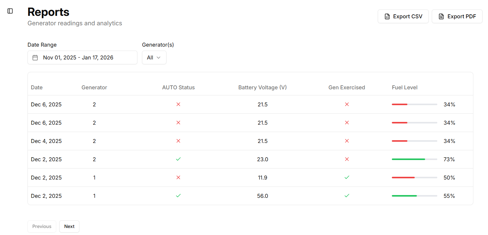

#  Documentation of my best project


## Generator Maintainer - INTERNAL PROJECT THAT LED TO MY PROMOTION (2025)



A tool for managing generator systems. I mainly worked on the backend but sometimes contributed to frontend features.  

**Favorite Piece of Code (Frontend):** Cursor-based pagination for navigating generator readings smoothly.

```typescript
const [params, setParams] = useState<ReadingsParams>({
  startDate: new Date(),
  endDate: new Date(),
  limit: PAGE_LIMIT,
  gen: DEFAULT_GENS
});

const [cursorStack, setCursorStack] = useState<string[]>([]);

const handleNext = () => {
  if (data?.nextCursor) {
    setCursorStack([...cursorStack, params.cursor || ""]);
    setParams({ ...params, cursor: data.nextCursor });
  }
};

const handlePrevious = () => {
  const prevStack = [...cursorStack];
  const prevCursor = prevStack.pop();
  if (prevCursor !== undefined) {
    setCursorStack(prevStack);
    setParams({ ...params, cursor: prevCursor || undefined });
  }
};
```


## LITRAINER (2024) - OPEN SOURCE PASSION PROJECT THAT GAVE ME MY MOST LOVED AND IMPACTFUL PROJECT


A ReactJS app that uses Stockfish and the Lichess API to turn mistakes from online chess games into personalized learning puzzles.  

**Favorite Piece of Code (Experiment Start):** This snippet is where I realized I could leverage this data to create a chess site


```typescript
import { Chess } from "chess.js";
import openings from "./openings";
import { LichessEvaluation, LichessGameResponse, Puzzle, PositionOpening } from "@/typing/interfaces";
import { GamePhase } from "@/typing/enums";

export const parseGames = async (response: Response) => {
  if (!response.body) return;

  const reader = response.body.getReader();
  const decoder = new TextDecoder();
  let result = "";
  let chunk;

  while (!(chunk = await reader.read()).done) {
    result += decoder.decode(chunk.value, { stream: true });
  }

  const games = result.split("\n").filter((g) => g.trim() !== "");
  const evaluations: string[] = games.map((g) => JSON.parse(g).analysis);

  const parsedGames: LichessGameResponse[] = games.map((line) => {
    const game = JSON.parse(line);
    return {
      players: game.players,
      moves: game.moves,
      game_id: game.id,
      fen: game.fen,
      perf: game.perf,
      rated: game.rated,
      status: game.status,
      variant: game.variant,
      clock: game.clock,
      winner: game.winner,
      opening: game.opening,
      division: game.division
    };
  });

  return { evaluations, games: parsedGames };
};
```

## Arcade Car Game (2022)


A fast-paced browser game where the player controls a car, avoids obstacles and tries to survive as long as possible

**Favorite Piece of Code (Experiment Start):** This is beginners code but I like this snippet because the car game was birthed from this idea I had to use 2 roads and swap them at the right time repeatedly to create the illusion of a moving road. 

```javascript
const roadAnimation = () => {
  canvasContext.drawImage(
    frontRoad.getImage(),
    frontRoad.getXCoordinate(),
    frontRoad.getYCoordinate(),
    canvas.width,
    canvas.height
  );
  canvasContext.drawImage(
    backRoad.getImage(),
    backRoad.getXCoordinate(),
    backRoad.getYCoordinate(),
    canvas.width,
    canvas.height
  );

  frontRoad.updateYCoordinate();
  backRoad.updateYCoordinate();

  if (frontRoad.getYCoordinate() >= canvas.height) {
    frontRoad.resetYCoordinate(true);
    backRoad.resetYCoordinate(false);
  }
};

```
